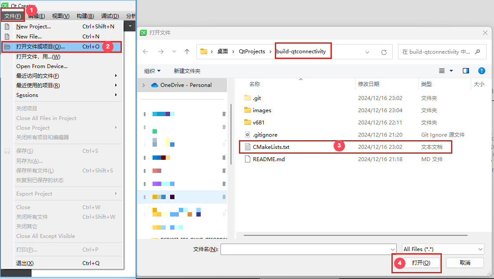
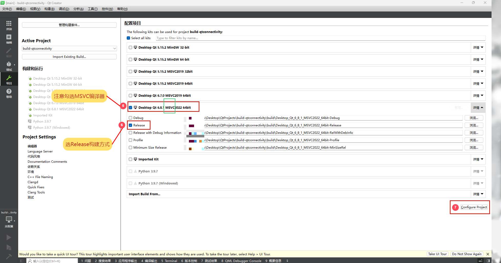
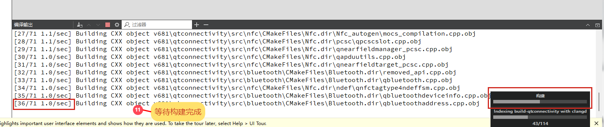
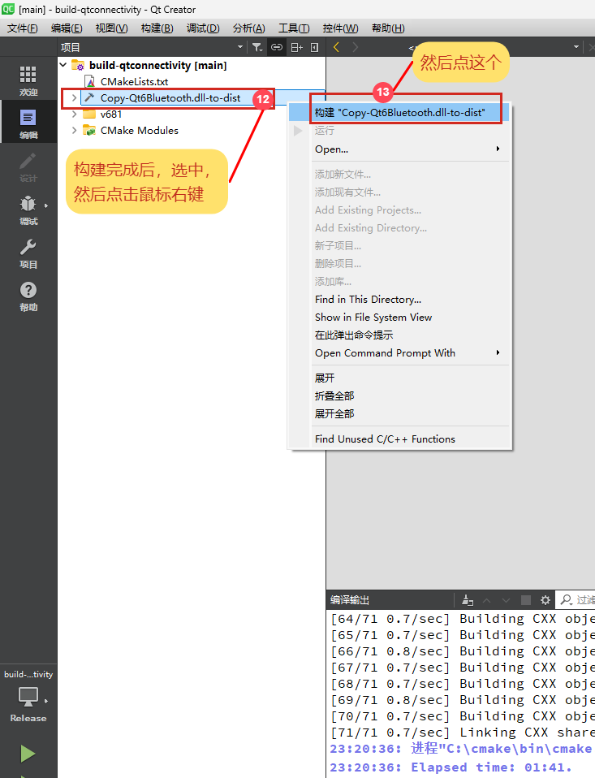
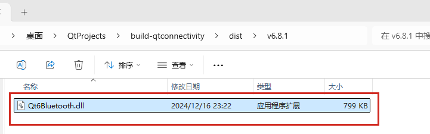

# build-qtconnectivity

## 说明

[qtconnectivity](https://github.com/qt/qtconnectivity) 的蓝牙模块在 Windows 平台下存在一些 Bug, 这个工程对 `qtconnectivity/src/bluetooth` 源码进行了修改,
尝试修复使用过程中发现的 bug, 并编译生成 `Qt6Bluetooth.dll` 动态链接库. 

## 使用

使用 **Qt Creator** 打开 [CMakeLists.txt](./CMakeLists.txt) 文件, 配置项目(编译器必须使用 MSVC,  构建方式选择 Release), 然后在顶部菜单栏依次选择: 构建 -> 构建项目 "build-qtconnectivity", 编译完成后新的 `Qt6Bluetooth.dll` 文件保存在 `dist/构建版本/Qt6Bluetooth.dll`. 具体步骤查看下图:









要使用新的 `Qt6Bluetooth.dll`, 需要先使用 `windeployqt` 命令将 Qt 应用程序所需的所有依赖库、插件、配置文件和其他资源复制到 exe 文件所在的目录下, 然后复制新的 `Qt6Bluetooth.dll` 到 exe 文件所在的目录, 覆盖掉 `windeployqt` 命令复制的 `Qt6Bluetooth.dll` 文件. 

注意: exe 的也要选择 MSVC 编译器, 并且 Qt 版本必须和编译此工程所选择的 Qt 版本一样, 否则报如下错误:
```
无法定位程序输入点
?address@QBluetoothDevicelnfo@@QEBA?AVQBluetoothAddress@@X
Z于动态链接库
```
